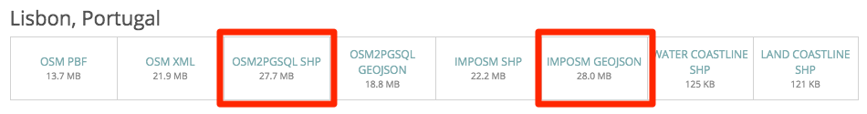

# Download OpenStreetMap data with Metro Extracts

Metro Extracts are chunks of OpenStreetMap data clipped to the rectangular region surrounding a particular city or region of interest. Data is available for locations around the world.

To download the OSM data, go to the Metro Extracts download page at https://mapzen.com/data/metro-extracts/ and choose a city.

## Background of the project

Mike Migurski initially created [OSM Metro Extracts](http://metro.teczno.com/) in 2011, responding to a really basic problem: if you wanted to use OSM data to make a map of, say, just the New York City metro area, you could either do a total planet download or download individual states from [Geofabrik](http://download.geofabrik.de/) and cobble together a metro area.

So Migurski set up and, for a while, hosted Metro Extract downloads. And [Nelson Minar](http://somebits.com/) and [Smart Chicago](http://www.smartchicagocollaborative.org/) and others in the mapping community contributed to it and helped maintain it. With [Extractotron](https://github.com/migurski/Extractotron/), if you wanted to get OSM data of just the New York City metro area, you could do so really easily.

Eventually Mapzen took on running and releasing Metro Extracts. There is a [chef recipe](https://github.com/mapzen/chef-metroextractor) to do it (if those words mean food to you, [go here](https://docs.getchef.com/essentials_cookbook_recipes.html)), which makes maintenance and updating the extracts easier.

##Choose a file format

When you download from Metro Extracts, you can choose from several formats that run a spectrum of raw to more processed from left to right. The less-processed formats, such as xml and osm, are intended for developers who are running their own tools on the data. For most map-making workflows, a shapefile or GeoJSON works well because these can be added directly to many software applications.

### OSM PBF and OSM XML

OSM is a special community. Likewise, OSM data is really special. So special, it gets its own file format that nobody else uses, .osm. These files can be compressed, either as XML .bx2 or .pbf. Just note that .pbf is smaller than XML (more on .pbf [here](http://wiki.openstreetmap.org/wiki/ProtocolBufBinary)).

If you're very particular about what you need to extract or want to run your on tools on the data, these formats are probably for you. If you want to filter for specific tagged OSM data, like `amenity=police`, you could use some of the same command line tools that generate Metro Extracts, such as [Osmosis](http://wiki.openstreetmap.org/wiki/Osmosis), [osm2pgsql](https://github.com/openstreetmap/osm2pgsql), and [ogr2ogr](http://www.gdal.org/ogr2ogr.html) to generate a GeoJSON with an OSM dataset custom to your needs.

### OSM2PGSQL and IMPOSM

The names and contents of the shapefiles and GeoJSON files are based on the process used to extract the OSM data: `osm2pgsql` or `imposm`. When you download a Metro Extract created with [osm2pgsql](http://wiki.openstreetmap.org/wiki/Osm2pgsql), you get three datasets split by geometry type: lines, points, or polygons. The [imposm](http://imposm.org/) extracts, however, are grouped into individual layers based on the tags used in OSM, such as buildings and roads.

Here is an example of a point dataset from osm2pgsql:

	{
    "type": "Feature",
    "properties": {
        "osm_id": 368395980,
        "access": null,
        "aerialway": null,
        "aeroway": "helipad",
        "amenity": null,
        "area": null,
        "barrier": null,
        "bicycle": null,
        "brand": null,
        "bridge": null,
        "boundary": null,
        "building": null,
        "capital": null,
        "covered": null,
        "culvert": null,
        "cutting": null,
        "disused": null,
        "ele": "33",
        "embankment": null,
        "foot": null,
        "harbour": null,
        "highway": null,
        "historic": null,
        "horse": null,
        "junction": null,
        "landuse": null,
        "layer": null,
        "leisure": null,
        "lock": null,
        "man_made": null,
        "military": null,
        "motorcar": null,
        "name": "Unisys Heliport",
        "natural": null,
        "oneway": null,
        "operator": null,
        "poi": null,
        "population": null,
        "power": null,
        "place": null,
        "railway": null,
        "ref": null,
        "religion": null,
        "route": null,
        "service": null,
        "shop": null,
        "sport": null,
        "surface": null,
        "toll": null,
        "tourism": null,
        "tower:type": null,
        "tunnel": null,
        "water": null,
        "waterway": null,
        "wetland": null,
        "width": null,
        "wood": null,
        "z_order": null
    },
    "geometry": {
        "type": "Point",
        "coordinates": [
            -74.50099,
            40.3709408
        ]
    }
    }

That's a lot of information to explain that this is a helipad. Basically, every OSM tag that could be applied to a point, line, or polygon is stored as a feature property within that point, line, or polygon.

`imposm` exports are a little more granular and grouped into multiple datasets, most of which are important OSM tags that make sense to separate (administrative polygons, waterways, roads, and so on). Some versions of the same dataset that have been simplified; if the filename has the suffix `gen`, it's been generalized.

All extracted shapefiles and GeoJSONs use EPSG:4326 for the projection.

- imposm shapefiles: EPSG:4326
- osm2pgsql shapefiles: EPSG:4326
- GeoJSONs (imposm and osm2pgsql): EPSG:4326

#### Technical details osm2pgsql and imposm files

If you're working with spatial data, you're most likely working with SQL data. `osm2pgsql` and `imposm` are tools for importing .osm data into PostGIS. Mapzen's chef recipe then generates shapefiles using the PostGIS command [pgsql2shp](http://www.bostongis.com/pgsql2shp_shp2pgsql_quickguide.bqg) and GeoJSONs using `ogr2ogr`. `osm2pgsql` and imposm carve up .osm data in different ways that you can configure yourself.

## Do more with Metro Extracts

If you want OpenStreetMap data for a city that is not currently available from Metro Extracts, you can follow the [instructions for contributing](https://github.com/mapzen/metroextractor-cities#contributing), or [open an issue](https://github.com/mapzen/metroextractor-cities/issues) requesting that your city be added to list.

If you want to learn more about the Metro Extracts formats and what you can do with the data, follow this [tutorial](walkthrough.md). In the lesson, you will review the available file formats, load the Metro Extracts data into QGIS, perform attribute queries, and change the symbols used to draw the features.
